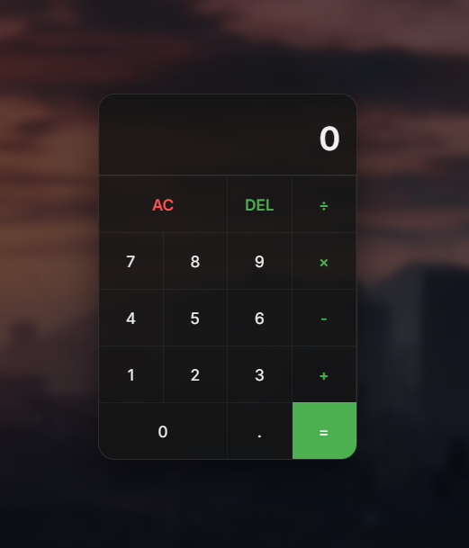

# 🟩 Grove Street Calculator

> "Ah sh*t, here we go again." - Mas dessa vez é com código limpo e moderno.



Você pode visualizar o layout do projeto através [deste link](...).
## 💻 Sobre o Projeto

Este projeto é uma **Calculadora Web** desenvolvida com foco em UI Design moderno. A ideia foi unir a nostalgia do **GTA San Andreas** com as tendências atuais de design de interfaces.

Utilizei a paleta de cores icônica da **Grove Street Families** (Verde, Preto e Branco) aplicada em uma estética **Glassmorphism** (efeito de vidro fosco), criando uma ferramenta que é nostálgica, mas visualmente contemporânea.

## ⚙️ Funcionalidades

O projeto não é apenas visual, o "motor" JavaScript foi aprimorado para uso real:

* **🎨 UI Temática:** Fundo imersivo com desfoque (`backdrop-filter`) e cores baseadas no personagem Carl Johnson (CJ).
* **⌨️ Suporte a Teclado:** Digite usando o NumPad ou teclado numérico do seu PC.
* **🧮 Precisão Matemática:** Tratamento de arredondamento para evitar erros de ponto flutuante (ex: dízimas infinitas).
* **🚫 Tratamento de Erros:** Impede divisão por zero e estouro de limite de caracteres no display.
* **📱 Responsividade:** Visual agradável e centralizado.

## 🛠️ Tecnologias Utilizadas

* **HTML5:** Estrutura semântica.
* **CSS3:** Variáveis (`:root`), Flexbox, Grid Layout e Glassmorphism.
* **JavaScript (ES6+):** Manipulação do DOM, Event Listeners e lógica matemática.

## 🚀 Como testar na sua máquina

1. **Clone o repositório:**
   ```bash
   git clone ...